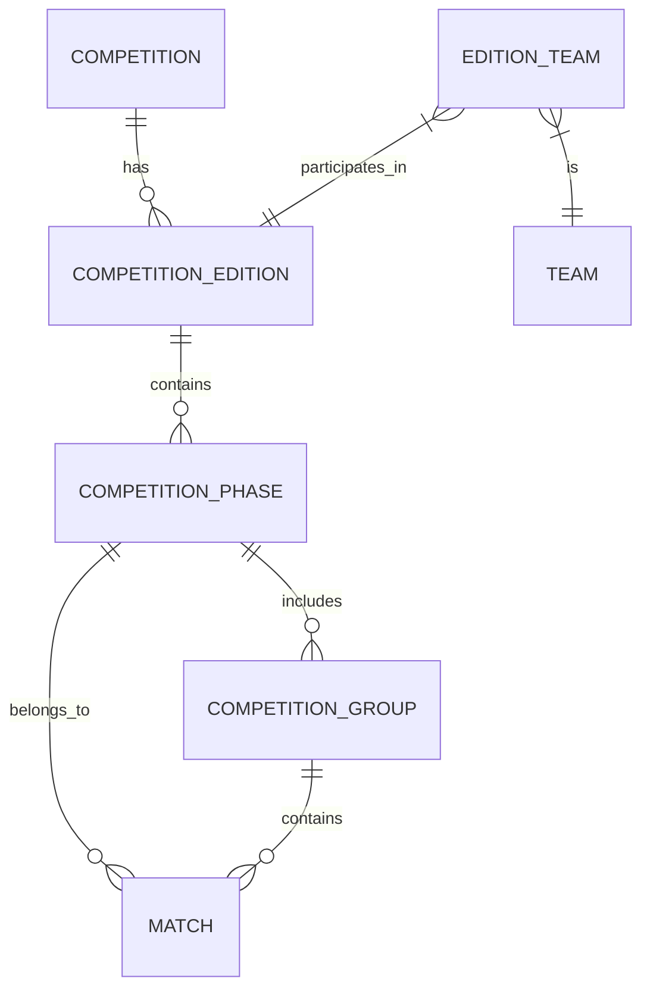

# Database Schema & ER Diagram

This document describes the relational model for the Football Archive system, including the multi-phase competition support.

## Entity Relationship Diagram

## Core Tables

### 1. `competitions`

General competition data (e.g., "Serie A", "Champions League").

### 2. `competition_editions`

A specific season or edition of a competition (e.g., "2023/24").

### 3. `competition_phases`

Major moments or stages of a season.

- `id`: (PK)
- `edition_id`: (FK -> `competition_editions.id`)
- `name`: string (e.g., "Regular Season", "Play-off", "Group Stage")
- `type`: enum (`GROUP`, `KNOCKOUT`)
- `order_index`: integer (Sequence of phases)
- `metadata`: JSONB (Points config, qualification rules, etc.)

### 4. `competition_groups`

Sub-sets within a phase (e.g., "Group A", "Main Group").

- `id`: (PK)
- `phase_id`: (FK -> `competition_phases.id`)
- `name`: string

### 5. `matches`

The individual match events.

- `id`: (PK)
- `edition_id`: (FK -> `competition_editions.id`)
- `phase_id`: (FK -> `competition_phases.id`)
- `group_id`: (FK -> `competition_groups.id`) [Optional]
- `home_team_id`: (FK -> `teams.id`)
- `away_team_id`: (FK -> `teams.id`)
- `home_goals`: integer
- `away_goals`: integer
- `match_date`: timestamp
- `round`: string (Matchday or Knockout label)
- `stadium`: string

### 6. `teams`

Team master data.

### 7. `edition_teams` (Implicit/Join)

The set of teams participating in a specific edition.
